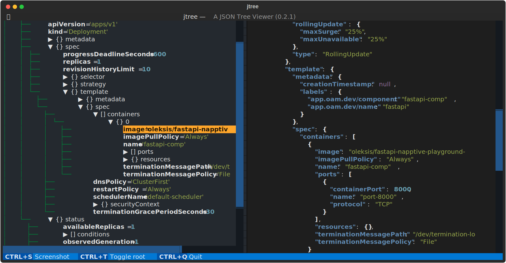

# jtree
jtree is a command interface for displaying JSON (JavaScript Object Notation). It is based on the [Textual](textual.textualize.io/) a TUI (Text User Interface) framework for Python.

## Install
```bash
➜ python -m pip install -r requirements.txt

➜ python -m pip install -e .
```

## Usage
```bash
➜ kubectl --kubeconfig .\napptive-kubeconfig get deployment -ojson > deployment.json

➜ python jtree.py .\deployment.json
```
